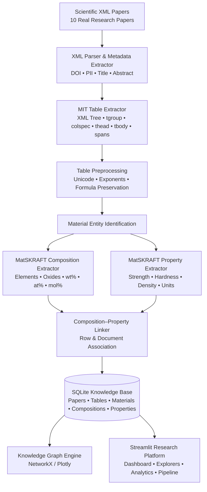
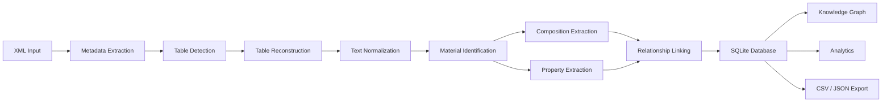

# 🔬 MatGraph Extractor

### AI-Driven Material Knowledge Mining from Scientific Tables

[](https://www.python.org/)
[](https://github.com/)
[](https://streamlit.io/)
[](https://sqlite.org/)
[](#-testing)
[](#-project-status)

> **B.Tech Computer Science & Engineering — 6th Semester Capstone Project 4**
> **Continuation and Extension of Project 3: MatSKRAFT Preprocessing Pipeline**

MatGraph Extractor is an end-to-end **scientific material knowledge mining and visualization platform** designed to automatically extract material compositions, experimental properties, and composition–property relationships from scientific research tables.

The system combines **scientific XML parsing, table structure extraction, material entity identification, chemical composition extraction, property normalization, relational linking, SQLite knowledge storage, NetworkX graph construction, and Streamlit visualization** into a unified research platform.

---

## 📑 Table of Contents

* [Overview](#-overview)
* [Motivation](#-motivation)
* [Objectives](#-objectives)
* [Key Features](#-key-features)
* [System Architecture](#-system-architecture)
* [Pipeline Workflow](#-pipeline-workflow)
* [Technologies Used](#-technologies-used)
* [Dataset](#-dataset)
* [Evaluation Results](#-evaluation-results)
* [Knowledge Base](#-knowledge-base)
* [Streamlit Platform](#-streamlit-platform)
* [Project Structure](#-project-structure)
* [Installation](#-installation)
* [Running the Project](#-running-the-project)
* [Testing](#-testing)
* [Example Workflow](#-example-workflow)
* [Research Applications](#-research-applications)
* [Limitations](#-limitations)
* [Future Scope](#-future-scope)
* [Project Status](#-project-status)
* [Academic Context](#-academic-context)
* [Team](#-team)
* [License](#-license)

---

# 📌 Overview

Scientific materials research contains large amounts of structured experimental information inside tables. These tables frequently contain:

* Material compositions
* Chemical elements and oxides
* Weight, atomic, and molar percentages
* Mechanical properties
* Electrical and thermal properties
* Processing conditions
* Experimental measurements
* Multi-level column headers
* Row and column spans
* Units and scientific notation
* Footnotes and references

Traditional text-based information extraction systems often lose the **two-dimensional structure and relationships** represented by scientific tables.

**MatGraph Extractor** addresses this problem by converting scientific XML articles and their tables into a structured material knowledge base and an interactive knowledge graph.

---

# 🎯 Motivation

A significant portion of experimentally reported material information is embedded in tables rather than ordinary prose.

For example, a scientific table may conceptually contain:

| Material       | Composition    | Strength | Hardness |    Density |
| -------------- | -------------- | -------: | -------: | ---------: |
| Ti-6Al-4V      | Ti-6Al-4V      |  950 MPa |   349 HV | 4.43 g/cm³ |
| Ti-10V-2Fe-3Al | Ti-10V-2Fe-3Al | 1100 MPa |   380 HV | 4.65 g/cm³ |

A conventional linear text extraction pipeline may fail to preserve the relationship between:

**Material → Composition → Property → Value → Unit**

MatGraph Extractor transforms these relationships into structured records that can be queried, analyzed, and visualized.

---

# 🎯 Objectives

The primary objectives of the project are:

1. Parse real scientific research articles represented as XML.
2. Extract paper metadata such as DOI, PII, title, and abstract.
3. Automatically identify and extract scientific tables.
4. Preserve complex table structures including headers, spans, and footnotes.
5. Normalize scientific text and Unicode representations.
6. Identify material entities from table content.
7. Extract chemical compositions and stoichiometric information.
8. Identify composition units such as:

   * `wt%`
   * `at%`
   * `mol%`
9. Extract experimentally measured material properties.
10. Standardize scientific units such as:

    * `MPa`
    * `GPa`
    * `g/cm³`
    * `K`
    * `S/cm`
11. Link compositions with their corresponding material properties.
12. Store extracted knowledge in a relational SQLite database.
13. Construct multi-relational material knowledge graphs.
14. Provide an interactive Streamlit research interface.
15. Enable researchers to inspect, analyze, and export extracted knowledge.

---

# ✨ Key Features

### 📄 Scientific XML Processing

* Parses real research article XML files.
* Extracts document metadata.
* Handles multiple scientific papers in batch.

### 📊 Scientific Table Extraction

* Detects tables from XML.
* Processes `tgroup`, `colspec`, `thead`, and `tbody`.
* Handles row and column spans.
* Preserves table structure.
* Extracts captions and footnotes.

### 🧪 Material Entity Extraction

Identifies materials including:

* Alloys
* Battery materials
* Ceramics
* Perovskites
* High-entropy alloys
* Superconductors
* Thermoelectrics
* Glasses
* Electrolytes
* Shape-memory alloys

### ⚗️ Chemical Composition Extraction

Extracts chemical components including:

* Elements
* Oxides
* Chemical formulas
* Stoichiometric ratios
* Weight fractions
* Atomic fractions
* Molar fractions

Examples:

`Ti`, `Al`, `V`, `SiO₂`, `Li`, `Co`, `BaO`, `ZrO₂`

### 📐 Property Extraction

The system extracts quantitative experimental properties such as:

* Yield strength
* Tensile strength
* Hardness
* Density
* Young's modulus
* Dielectric constant
* Curie temperature
* Critical temperature
* Electrical conductivity
* Ionic conductivity
* Seebeck coefficient
* Activation energy
* Fracture toughness
* Recovery strain

### 🔗 Composition–Property Linking

Extracted information is associated into relational records:

```text
Paper
  ↓
Table
  ↓
Material
  ↓
Composition
  ↓
Property
  ↓
Value + Unit
```

### 🕸️ Knowledge Graph

The extracted knowledge can be represented as a multi-relational graph:

```text
Paper
 └── Table
      └── Material
           ├── Component
           └── Property
                 ├── Value
                 └── Unit
```

### 📈 Interactive Analytics

The Streamlit platform provides:

* Property distributions
* Histograms
* Boxplots
* Material comparisons
* Component frequency analysis
* Cross-property analysis
* Dataset export

---

# 🏗️ System Architecture



---

# 🔄 Pipeline Workflow



### Processing stages

#### 1. Document ingestion

Scientific XML documents are loaded into the processing pipeline.

#### 2. Metadata extraction

The parser identifies:

* DOI
* PII
* Title
* Abstract
* Journal metadata

#### 3. Table extraction

Scientific tables are detected and reconstructed from their XML hierarchy.

#### 4. Table preprocessing

The extracted table content is normalized while preserving:

* Chemical formulas
* Subscripts
* Superscripts
* Unicode symbols
* Scientific notation
* Units

#### 5. Material identification

Material names and material-related entities are detected from table content.

#### 6. Composition extraction

Chemical components and composition values are extracted and normalized.

#### 7. Property extraction

Experimental properties and their corresponding numerical values and units are identified.

#### 8. Relationship linking

Composition and property information is linked to the appropriate material and source table.

#### 9. Knowledge-base construction

The structured information is stored in SQLite.

#### 10. Visualization and analytics

The resulting dataset is exposed through the Streamlit platform and knowledge graph.

---

# 🛠️ Technologies Used

| Technology                      | Purpose                                             |
| ------------------------------- | --------------------------------------------------- |
| **Python 3.10+**                | Core development language                           |
| **MatSKRAFT**                   | Material composition/property extraction foundation |
| **XML / JATS / Scientific XML** | Research article representation                     |
| **Pandas**                      | Data processing and analysis                        |
| **SQLite3**                     | Knowledge-base storage                              |
| **NetworkX**                    | Knowledge graph construction                        |
| **Plotly**                      | Interactive visualization                           |
| **Streamlit**                   | Web-based research interface                        |
| **unittest**                    | Automated testing                                   |

---

# 📚 Dataset

The current implementation processes **10 authentic materials-science research XML papers** covering multiple material classes.

| #  | Material Domain        | Example Materials                  | Extracted Properties                         |
| -- | ---------------------- | ---------------------------------- | -------------------------------------------- |
| 01 | Titanium Alloys        | Ti-6Al-4V, Ti-10V-2Fe-3Al          | Strength, hardness, density                  |
| 02 | Battery Cathodes       | LiCoO₂, LiFePO₄, NCA, NMC111       | Capacity, voltage, energy density            |
| 03 | Perovskite Dielectrics | BaTiO₃, PZT, KNN                   | Dielectric constant, Tc, d₃₃                 |
| 04 | High-Entropy Alloys    | CoCrFeNi, AlCoCrFeNi               | Hardness, yield strength, plastic strain     |
| 05 | Bioactive Glasses      | 45S5, 13-93, Pyrex                 | Density, Tg, Young's modulus                 |
| 06 | Superconductors        | YBCO, Bi-2223, MgB₂, FeSe          | Tc, Hc₂, Jc                                  |
| 07 | Thermoelectrics        | Bi₂Te₃, PbTe, SnSe                 | Seebeck coefficient, conductivity, ZT        |
| 08 | Aerospace Aluminum     | Al 2024-T3, Al 7075-T6, Al-Li 2195 | Yield strength, fracture toughness           |
| 09 | SOFC Electrolytes      | 8YSZ, 10CGO, LSGM, LSCF            | Ionic conductivity, activation energy        |
| 10 | Shape-Memory Alloys    | Ni₅₀.₂Ti₄₉.₈, Cu-Al-Ni             | Transformation temperatures, recovery strain |

> **Note:** The dataset is intended for project evaluation and demonstration of the extraction pipeline.

---

# 📊 Evaluation Results

All metrics below were obtained from the local execution of the current Phase 1 & Phase 2 implementation.

| Metric                              |       Result |
| ----------------------------------- | -----------: |
| Scientific papers processed         |       **10** |
| Paper processing success rate       |   **100.0%** |
| Tables detected and extracted       |       **20** |
| Table extraction success rate       |   **100.0%** |
| Unique material entities            |       **50** |
| Unique chemical components / oxides |       **49** |
| Unique physical properties          |       **32** |
| Composition records mined           |      **205** |
| Property measurements extracted     |      **255** |
| Composition–property linked records |      **255** |
| Numeric value validity ratio        |   **98.43%** |
| Unit completeness ratio             |   **98.04%** |
| Average parse time per paper        | **~0.005 s** |

### 📈 Key observations

* All 10 input papers were processed without document-level crashes.
* All 20 detected tables were successfully parsed.
* More than 200 composition records were extracted.
* More than 250 quantitative property measurements were identified.
* Scientific units were normalized into canonical representations.
* Extracted information was linked into a structured material knowledge base.

---

# 🗄️ Knowledge Base

The extracted information is persisted in a SQLite database.

Conceptually, the database contains entities representing:

```text
Papers
  │
  ├── Tables
  │     │
  │     └── Materials
  │            │
  │            ├── Compositions
  │            │      └── Components
  │            │
  │            └── Properties
  │                   ├── Value
  │                   └── Unit
```

This structure enables queries such as:

* Which materials contain a particular element?
* What compositions are associated with a material?
* Which properties were reported for a material?
* Which papers contain a specific material?
* What units were used for a property?
* Which materials have the highest reported strength?
* Which material classes contain a particular oxide?

---

# 🖥️ Streamlit Platform

The project provides a multi-page interactive research platform.

### 1. 📊 Dashboard

Provides an overview of the extracted knowledge base.

Features:

* Total papers
* Total tables
* Material count
* Property count
* Composition count
* Property charts
* Chemical component frequency

---

### 2. 📄 Paper Explorer

Allows users to browse individual papers.

Displays:

* Paper title
* DOI
* PII
* Abstract
* Metadata
* Associated tables

---

### 3. 📋 Table Explorer

Provides detailed inspection of extracted tables.

Features:

* Raw XML table view
* Cleaned table view
* Table captions
* Footnotes
* Normalized values
* CSV export
* JSON export

---

### 4. 🔬 Material Explorer

Search and inspect individual materials.

Example searches:

```text
Ti-6Al-4V
BaTiO₃
LiFePO₄
CoCrFeNi
Bi₂Te₃
```

Provides:

* Composition information
* Chemical components
* Property measurements
* Source papers
* Visual summaries

---

### 5. 🕸️ Knowledge Graph

Visualizes relationships between:

```text
Paper
   ↓
Table
   ↓
Material
   ↓
Composition / Component
   ↓
Property
   ↓
Value / Unit
```

The graph is implemented using **NetworkX** and interactive visualization components.

---

### 6. 📈 Analytics

Provides exploratory analysis including:

* Property histograms
* Boxplots
* Material comparisons
* Cross-property trade-offs
* Component frequency analysis
* Dataset statistics
* Full dataset export

---

### 7. ⚙️ Processing Pipeline

Provides an interface for processing additional XML documents.

Features include:

* XML upload
* Pipeline execution
* Processing status
* Execution logs
* Extraction summaries

---

### 8. 👥 Team & Project Information

Contains:

* Project overview
* Architecture
* Team/task allocation
* Capstone information
* Viva preparation questions
* Development information

---

# 📁 Project Structure

A recommended repository structure is:

```text
MatGraph-Extractor/
│
├── app/
│   ├── streamlit_app.py
│   └── pages/
│       ├── 1_📊_Dashboard.py
│       ├── 2_📄_Paper_Explorer.py
│       ├── 3_📋_Table_Explorer.py
│       ├── 4_🔬_Material_Explorer.py
│       ├── 5_🕸️_Knowledge_Graph.py
│       ├── 6_📈_Analytics.py
│       ├── 7_⚙️_Processing_Pipeline.py
│       └── 8_👥_Team_and_Project_Info.py
│
├── data/
│   ├── raw/
│   │   └── *.xml
│   └── processed/
│
├── database/
│   └── matgraph.db
│
├── scripts/
│   └── process_papers.py
│
├── src/
│   ├── xml_parser.py
│   ├── table_extractor.py
│   ├── table_preprocessor.py
│   ├── material_extractor.py
│   ├── composition_extractor.py
│   ├── property_extractor.py
│   ├── linker.py
│   └── knowledge_graph.py
│
├── tests/
│   ├── test_*.py
│   └── ...
│
├── requirements.txt
├── run.sh
├── run.bat
├── README.md
└── LICENSE
```

> Adjust the structure above to match the actual repository layout before publishing.

---

# 🚀 Installation

## Prerequisites

Make sure the following are installed:

* Python **3.10 or higher**
* Git
* pip

Verify Python:

```bash
python --version
```

---

## Clone the Repository

```bash
git clone https://github.com/your-username/MatGraph-Extractor.git
cd MatGraph-Extractor
```

Replace `your-username` with the actual GitHub username or organization hosting the repository.

---

## Install Dependencies

```bash
pip install -r requirements.txt
```

For better isolation, a virtual environment is recommended:

```bash
python -m venv .venv
```

### Linux / macOS

```bash
source .venv/bin/activate
pip install -r requirements.txt
```

### Windows

```powershell
.venv\Scripts\activate
pip install -r requirements.txt
```

---

# ▶️ Running the Project

## Step 1 — Process the Scientific Papers

Run the knowledge-mining pipeline:

```bash
python3 scripts/process_papers.py
```

This performs:

```text
XML
 ↓
Metadata
 ↓
Tables
 ↓
Normalization
 ↓
Materials
 ↓
Compositions
 ↓
Properties
 ↓
Relationships
 ↓
SQLite
```

---

## Step 2 — Launch the Streamlit Application

```bash
streamlit run app/streamlit_app.py
```

Streamlit will provide a local URL that can be opened in a browser.

---

## Alternative Launch

### macOS / Linux

```bash
./run.sh
```

### Windows

```batch
run.bat
```

---

# 🧪 Testing

Run the complete automated test suite:

```bash
python3 -m unittest discover -s tests -p "test_*.py"
```

Expected result:

```text
Ran 8 tests in 0.009s

OK
```

The tests cover the core extraction and processing functionality of the project.

---

# 🔬 Example Extraction Workflow

Consider a scientific table containing:

```text
Material       Composition       Yield Strength
Ti-6Al-4V      Ti-6Al-4V         950 MPa
```

The pipeline transforms the information into structured knowledge:

```text
Material:
    Ti-6Al-4V

Composition:
    Ti
    Al
    V

Property:
    Yield Strength

Value:
    950

Unit:
    MPa
```

The knowledge graph can then represent:

```text
Ti-6Al-4V
    │
    ├── contains → Ti
    ├── contains → Al
    ├── contains → V
    │
    └── has_property
            │
            └── Yield Strength
                    │
                    ├── value → 950
                    └── unit  → MPa
```

---

# 🌐 Research Applications

MatGraph Extractor can support several materials-informatics tasks:

### 🔎 Literature Mining

Automatically retrieve structured experimental information from large collections of scientific papers.

### 🧪 Materials Discovery

Compare materials based on their compositions and measured properties.

### 📊 Property Analysis

Analyze distributions and relationships between material properties.

### 🕸️ Knowledge Graph Construction

Build machine-readable relationships between papers, materials, compositions, and properties.

### 🤖 AI/ML Dataset Preparation

Generate structured datasets that can subsequently be used for:

* Property prediction
* Materials recommendation
* Similarity analysis
* Regression models
* Knowledge graph reasoning

### 📚 Scientific Information Retrieval

Allow researchers to query information that would otherwise require manually reading numerous tables.

---

# ⚠️ Limitations

The current implementation is a capstone-scale prototype and has several limitations:

* The current evaluation dataset contains 10 papers.
* Extraction quality depends on the structure and consistency of source XML.
* Highly irregular tables may require additional preprocessing.
* Ambiguous material-property relationships can be difficult to resolve automatically.
* Unit normalization currently focuses on supported scientific property units.
* Domain-specific terminology may require additional extraction rules.
* Automated extraction should be manually validated before use in high-stakes scientific analysis.

---

# 🔮 Future Scope

Potential future extensions include:

### 📚 Large-Scale Literature Ingestion

Expand from 10 papers to thousands or millions of scientific documents.

### 🤖 LLM-Assisted Extraction

Integrate domain-specific language models for improved:

* Material entity recognition
* Table interpretation
* Property identification
* Relationship extraction

### 🧠 Semantic Knowledge Graphs

Introduce ontology-based representations and semantic relationships.

### 🔍 Advanced Search

Support natural-language queries such as:

```text
"Find titanium alloys with yield strength above 900 MPa."
```

### 📈 Machine Learning Integration

Use the extracted database to train models for material property prediction.

### 🔗 External Knowledge Integration

Connect the graph with external materials databases and scientific repositories.

### ⚡ Distributed Processing

Enable parallel processing of large scientific literature collections.

### 🧾 Provenance Tracking

Maintain cell-level provenance so every extracted value can be traced back to its source paper and table.

---

# 📌 Project Status

| Phase                            | Status     |
| -------------------------------- | ---------- |
| Scientific XML ingestion         | ✅ Complete |
| Metadata extraction              | ✅ Complete |
| Table extraction                 | ✅ Complete |
| Table preprocessing              | ✅ Complete |
| Material identification          | ✅ Complete |
| Composition extraction           | ✅ Complete |
| Property extraction              | ✅ Complete |
| Composition–property linking     | ✅ Complete |
| SQLite knowledge base            | ✅ Complete |
| Knowledge graph                  | ✅ Complete |
| Streamlit dashboard              | ✅ Complete |
| Analytics                        | ✅ Complete |
| Automated testing                | ✅ Complete |
| Large-scale literature ingestion | 🔄 Future  |
| LLM-assisted extraction          | 🔄 Future  |
| ML property prediction           | 🔄 Future  |

**Current Status: Phase 1 & Phase 2 Complete ✅**

---

# 🎓 Academic Context

**Degree:** B.Tech Computer Science & Engineering
**Semester:** 6th Semester
**Project:** Capstone Project 4
**Project Type:** Research / Applied AI / Scientific Information Extraction
**Predecessor:** MatSKRAFT Preprocessing Pipeline — Project 3

### Core Research Areas

* Natural Language Processing
* Information Extraction
* Materials Informatics
* Scientific Document Mining
* Knowledge Graphs
* Data Engineering
* Machine Learning Dataset Construction
* Interactive Data Visualization

---

# 👥 Team

Add the project team information here:

| Member   | Role                     | Responsibilities                |
| -------- | ------------------------ | ------------------------------- |
| Member 1 | Project Lead             | Architecture & Integration      |
| Member 2 | NLP / Extraction         | Material & Property Extraction  |
| Member 3 | Data Engineering         | Database & Pipeline             |
| Member 4 | Frontend / Visualization | Streamlit & Graph Visualization |

> Replace the placeholder names and responsibilities with the actual team information.

---

# 📜 License

This project is developed as an academic capstone project.

Add the appropriate license file, such as `MIT`, `Apache-2.0`, or your university-specific license, before publishing the repository.

---

# ⭐ Acknowledgements

This project builds upon the research and preprocessing foundation of **MatSKRAFT** and applies scientific information extraction techniques to structured materials-science literature.

Special acknowledgement is given to the researchers and publishers whose scientific articles form the basis of the evaluation dataset.

---

## 📬 Contact

For questions, collaboration, or academic discussion, please open an issue in the repository or contact the project team.

---

## ⭐ If You Find This Project Useful

If MatGraph Extractor is useful for your research or learning:

* ⭐ Star the repository
* 🍴 Fork the project
* 🐛 Report issues
* 💡 Suggest improvements
* 🤝 Contribute through pull requests

**MatGraph Extractor — From Scientific Tables to Material Knowledge. 🔬🕸️**
