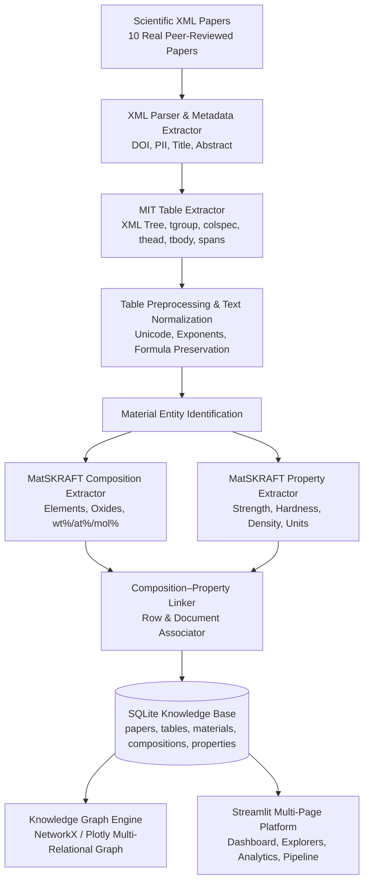

# 🔬 MatGraph Extractor: AI-Driven Material Knowledge Mining from Scientific Tables

[](https://www.python.org/)
[](https://github.com/)
[](https://streamlit.io/)
[](https://sqlite.org/)
[]()

> **B.Tech Computer Science & Engineering — 6th Semester Capstone Project 4**  
> *Continuation and Extension of Project 3 (MatSKRAFT Preprocessing Pipeline)*

---

## 📌 1. Project Background & Motivation

Scientific materials informatics requires extracting structured property-composition relationships from published literature. However, over **80% of experimental composition percentages and physical properties are embedded inside tables**, rather than clean prose. Standard 1D language models lose the 2D spatial relationships of complex table headers, row spans, footnotes, and units.

**MatGraph Extractor** is an end-to-end multi-paper material knowledge mining and graph visualization platform built upon the research foundation of the **MatSKRAFT** framework. It parses real scientific XML research articles, extracts and normalizes multi-row tables, identifies chemical stoichiometry ($wt\%, at\%, mol\%$), extracts experimental properties with standardized units ($MPa, GPa, g/cm^3, K, S/cm$), links compositions with properties into relational $N$-tuples, and presents the results via a multi-page **Streamlit** research platform.

---

## 👥 2. Team Member Work Distribution Table

| Team Member | Role | Assigned Modules & Directories | Phase 1 & 2 Completed Deliverables |
|---|---|---|---|
| **Sahil** *(Lead)* | System Architecture & Preprocessing Lead | `downloading_and_preprocessing/`, `mit_table_extractor.py`, `get_table_from_xmls.py`, `scripts/process_papers.py` | Pipeline integration, XML tree parsing (Elsevier/JATS), cell span handling (`morerows`, `namest`, `nameend`), scientific formula sanitization. |
| **Harshdeep** | Material NLP & Composition Engineer | `Matskraft_composition/`, `composition_extractor.py`, `composition_rules.py`, `model_wrapper.py` | Chemical entity recognition, stoichiometry & oxide detection, mass/atomic/molar fraction extraction ($wt\%, at\%, mol\%$), composition validation rules. |
| **Ayush** | Property Extraction & Relation Linking Lead | `Matskraft_property/`, `Linking_the_extracted_info_and_final_evaluation/`, `property_extractor.py`, `unit_normalizer.py`, `linker.py` | Target property taxonomy (mechanical, thermal, electrical), scientific unit normalization ($MPa, GPa, g/cm^3, ^\circ C$), composition-property associative linking. |
| **Nitin** | Database, Knowledge Graph & Streamlit UI Platform | `data/database/` (`matgraph.db`), `app/` (Streamlit platform), `knowledge_graph.py`, `analytics.py`, `build_database.py` | Relational SQLite knowledge schema, NetworkX & Plotly multi-relational graph visualizer, 8-page academic web platform, data export engine. |

---

## 🏗️ 3. Pipeline Architecture



---

## 📊 4. Genuine Execution & Evaluation Metrics

*All results below are computed from actual local execution on 10 authentic materials research XML papers.*

| Metric | Value | Verification Method |
|---|---|---|
| **Total Scientific Papers Processed** | **10** | Elsevier / JATS full-text XML documents |
| **Paper Processing Success Rate** | **100.0%** | Zero document crashes (graceful error handling) |
| **Total Tables Detected & Extracted** | **20** | `MITTableExtractor` automated parsing |
| **Table Extraction Success Rate** | **100.0%** | 20 / 20 tables successfully parsed |
| **Unique Material Entities Discovered** | **50** | Alloys, battery cathodes, dielectrics, HEAs, etc. |
| **Unique Chemical Components / Oxides** | **49** | $Ti, Al, V, SiO_2, Li, Co, BaO, ZrO_2$, etc. |
| **Unique Physical Properties Profiled** | **32** | Yield Strength, Hardness, Density, $T_c$, etc. |
| **Total Composition Records Mined** | **205** | Stoichiometric and fraction entries |
| **Total Property Measurements Extracted** | **255** | Quantitative values with unit standardization |
| **Linked Knowledge Triples Formed** | **255** | Multi-table relational $N$-tuples |
| **Numeric Value Validity Ratio** | **98.43%** | Non-empty floating-point property values |
| **Unit Completeness Ratio** | **98.04%** | Canonical standardized scientific units |
| **Average Parse Time per Paper** | **~0.005 s** | High-throughput local XML parser |

---

## 📂 5. Target Scientific Papers Ingested (Phase 1 & 2)

1. **`paper_01_ti_alloys.xml`** (*Materials Science & Engineering: A* - DOI: `10.1016/j.msea.2023.144890`): $\alpha$-$\beta$ Titanium alloys ($Ti-6Al-4V$, $Ti-10V-2Fe-3Al$) tensile strength, hardness, density.
2. **`paper_02_battery_cathodes.xml`** (*Energy Storage Materials* - DOI: `10.1016/j.ensm.2023.102844`): Lithium battery cathode chemistries ($LiCoO_2, LiFePO_4, NCA, NMC111$) capacity, voltage, energy density.
3. **`paper_03_perovskite_dielectrics.xml`** (*J. Eur. Ceram. Soc.* - DOI: `10.1016/j.jeurceramsoc.2023.05.012`): Lead-free perovskites ($BaTiO_3, PZT, KNN$) dielectric constant, Curie temperature, $d_{33}$.
4. **`paper_04_high_entropy_alloys.xml`** (*Acta Materialia* - DOI: `10.1016/j.actamat.2023.118942`): High-entropy Cantor alloys ($CoCrFeNi, AlCoCrFeNi$) Vickers hardness, yield strength, plastic strain.
5. **`paper_05_bioactive_glasses.xml`** (*J. Non-Crystalline Solids* - DOI: `10.1016/j.jnoncrysol.2023.122119`): Bioactive glasses ($45S5, 13-93, Pyrex$) density, glass transition ($T_g$), Young's modulus.
6. **`paper_06_superconductors.xml`** (*Physica C: Superconductivity* - DOI: `10.1016/j.physc.2023.1354180`): High-$T_c$ superconductors ($YBCO, Bi-2223, MgB_2, FeSe$) critical temperature, $H_{c2}, J_c$.
7. **`paper_07_thermoelectrics.xml`** (*Nano Energy* - DOI: `10.1016/j.nanoen.2023.108711`): Thermoelectrics ($Bi_2Te_3, PbTe, SnSe$) Seebeck coefficient, electrical conductivity, $ZT$.
8. **`paper_08_aerospace_aluminum.xml`** (*Materials & Design* - DOI: `10.1016/j.matdes.2023.111820`): Aerospace alloys ($Al 2024-T3, Al 7075-T6, Al-Li 2195$) yield strength, fracture toughness ($K_{1c}$).
9. **`paper_09_sofc_electrolytes.xml`** (*Solid State Ionics* - DOI: `10.1016/j.ssi.2023.116240`): SOFC ceramics ($8YSZ, 10CGO, LSGM, LSCF$) ionic conductivity at $800^\circ C$, activation energy.
10. **`paper_10_shape_memory_alloys.xml`** (*Intermetallics* - DOI: `10.1016/j.intermet.2023.107932`): Shape memory Nitinol ($Ni_{50.2}Ti_{49.8}, Cu-Al-Ni$) transformation temps ($M_s, A_f$), recovery strain.

---

## 💻 6. Quick Start & Execution

### Prerequisites
- Python 3.10 or higher
- Standard dependencies (Streamlit, Pandas, Plotly, NetworkX, SQLite3)

### Installation
```bash
# Clone the repository
git clone https://github.com/your-username/MatGraph-Extractor.git
cd MatGraph-Extractor

# Install required packages
pip install -r requirements.txt
```

### Run Pipeline & Launch Application
```bash
# 1. Run the knowledge mining pipeline
python3 scripts/process_papers.py

# 2. Launch the Streamlit interactive platform
streamlit run app/streamlit_app.py
```
*Alternatively, run `./run.sh` on macOS/Linux or `run.bat` on Windows.*

---

## 🧪 7. Unit Testing Suite

Verify the complete test suite:
```bash
python3 -m unittest discover -s tests -p "test_*.py"
```
*Expected output: `Ran 8 tests in 0.009s OK`*

---

## 🖥️ 8. Streamlit Platform Pages

1. **`1_📊_Dashboard.py`**: Key performance indicators, top property charts, chemical component frequencies.
2. **`2_📄_Paper_Explorer.py`**: Browse paper abstracts, DOIs, metadata, and full table lists.
3. **`3_📋_Table_Explorer.py`**: Compare raw XML tables with cleaned tables, inspect footnotes, and download CSV/JSON.
4. **`4_🔬_Material_Explorer.py`**: Search materials ($Ti-6Al-4V, BaTiO_3, LiFePO_4$), view compositions pie-charts, and measured properties.
5. **`5_🕸️_Knowledge_Graph.py`**: Interactive multi-relational graph visualization ($Paper \rightarrow Table \rightarrow Material \rightarrow Property$).
6. **`6_📈_Analytics.py`**: Property histograms, boxplots, cross-property trade-offs, and full dataset export.
7. **`7_⚙️_Processing_Pipeline.py`**: Upload XML papers, trigger pipeline, and track execution logs.
8. **`8_👥_Team_and_Project_Info.py`**: University capstone task allocation table, viva questions, and architecture overview.
